# Installation
Take Win10 x64 for example.

1. 双击Nolo_driver_for_windows_setup.msi，打开安装包。

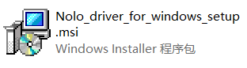
  

2. 点击“NEXT”。 

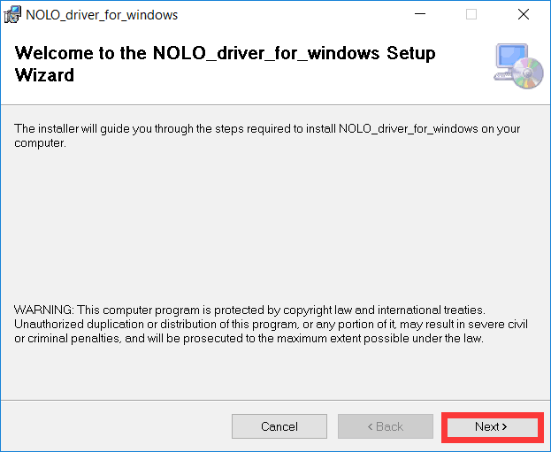
  

3. 选择一个安装路径，使用默认路径即可，然后点击“NEXT”。

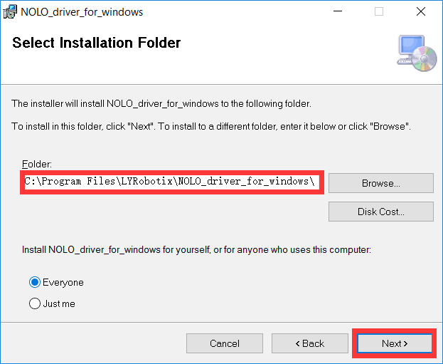
  

4. 继续点击“NEXT”。

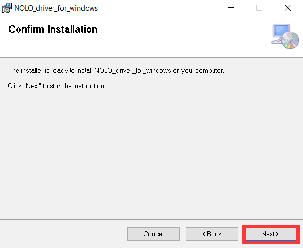
  

5. 首次安装会安装设备驱动，根据安装提示点击“下一步”。

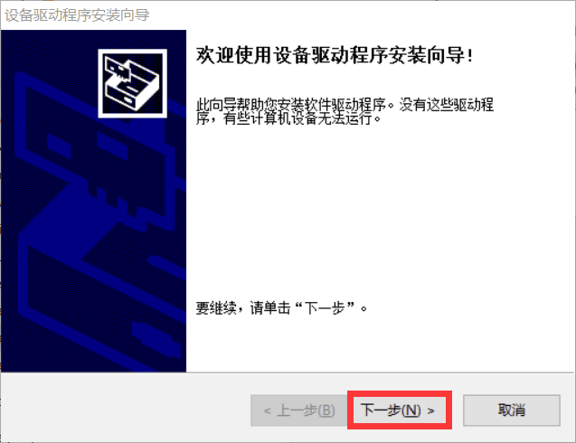
  

6. 安装完成后点击“完成”。

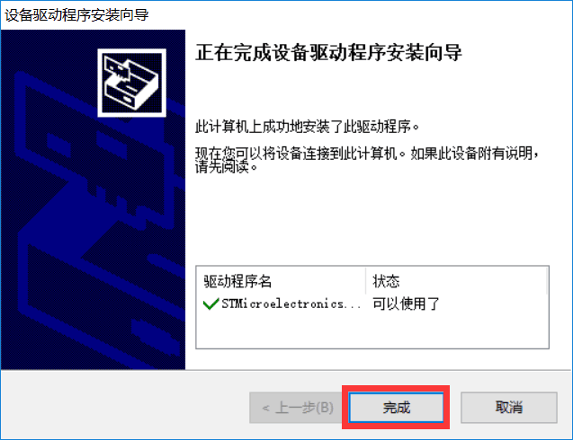
  

7. 如果软件检测到您的电脑中没有安装Microsoft Visual C++ 2013 Redistributable(x64)，会自动进入安装向导，请你根据提示进行安装。(存在Microsoft Visual C++ 2013 Redistributable(x64)的用户不会进入这步)  

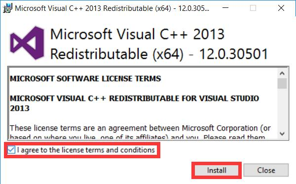
  

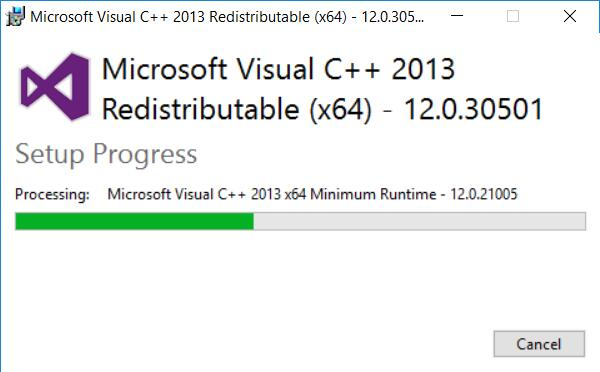
  

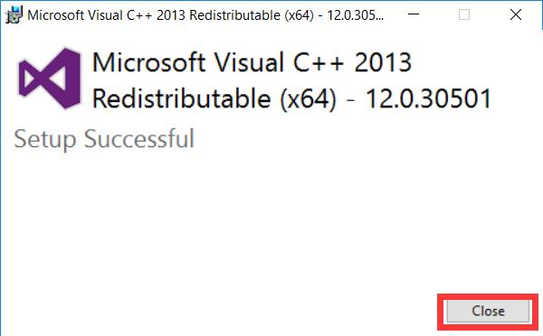
  

8. 如果软件检测到您的电脑中没有安装Microsoft Visual C++ 2015 Redistributable(x64)，会自动进入安装向导，请你根据提示进行安装。(存在Microsoft Visual C++ 2015 Redistributable(x64)的用户不会进入这步)

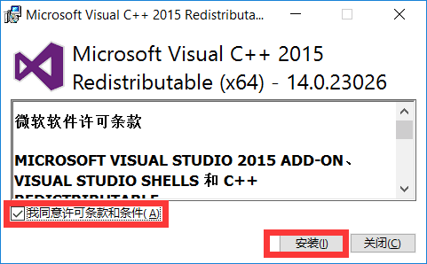
  

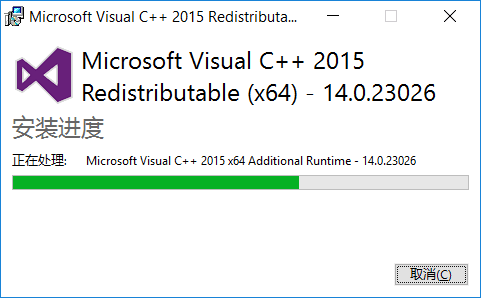
  

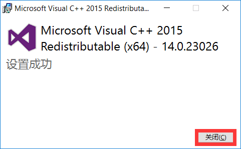
  

9. 点击“Close”完成安装。

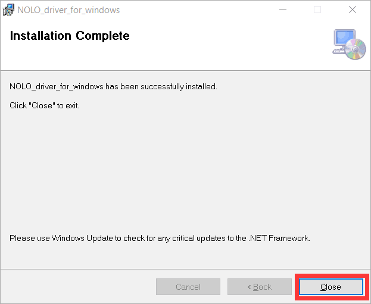
  