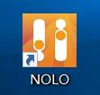
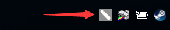

# Instructions
## Start up
Double click desktop shortcut to open.

  

NOLO-Driver-For-Windows will run minimize to the tray.

  
Right click: 

    

Plug the headset marker in computer.The correct state as shown:  
 

  

About Connection Status:Check the device connection status and power.  
About RiftCat/Trinus:
- Gear VR:Use Gear VR Play SteamVR.
- CardBoard:Use Other VR helmet Play SteamVR.  

About Frimware Upgrade:  

About Languages:Only supports Chinese and English.  

About Help:Get more help from the web.  

About Check:Check if there is a new version.  

About Exit:Close NOLO.

