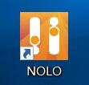
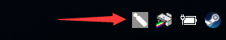
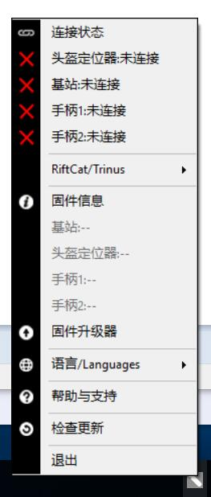
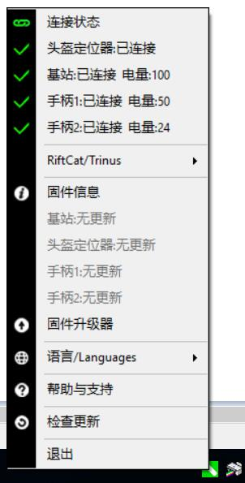

# 使用说明

双击桌面NOLO快捷方式打开NOLO。

  

NOLO启动后没有窗口，会最小化在右下角的托盘中。

  
在没有任何NOLO设备接入的情况下，右键托盘中的图标，如下图: 

    

当把NOLO设备全部开启，并头盔定位器通过USB线连接到电脑的时候，如下图所示:  
 

  

连接状态：这里显示NOLO当前设备的连接状态和电量信息，您可以通过这里检查设备是否处于正常状态。 
RiftCat/Trinus:
- Gear VR:如果您选择的三星手机+Gear VR请选择Gear VR模式。
- CardBoard:如果不是，请选择Cardboard模式。 

固件升级:  

语言选择：目前支持中文和英文两种语言。 

帮助与支持：打开NOLO帮助支持网站获取更多帮助。 

检测更新：检测当前版本是否是最新版本。 

退出：关闭NOLO程序。 

